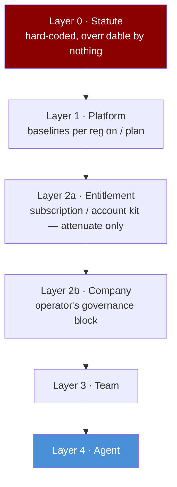
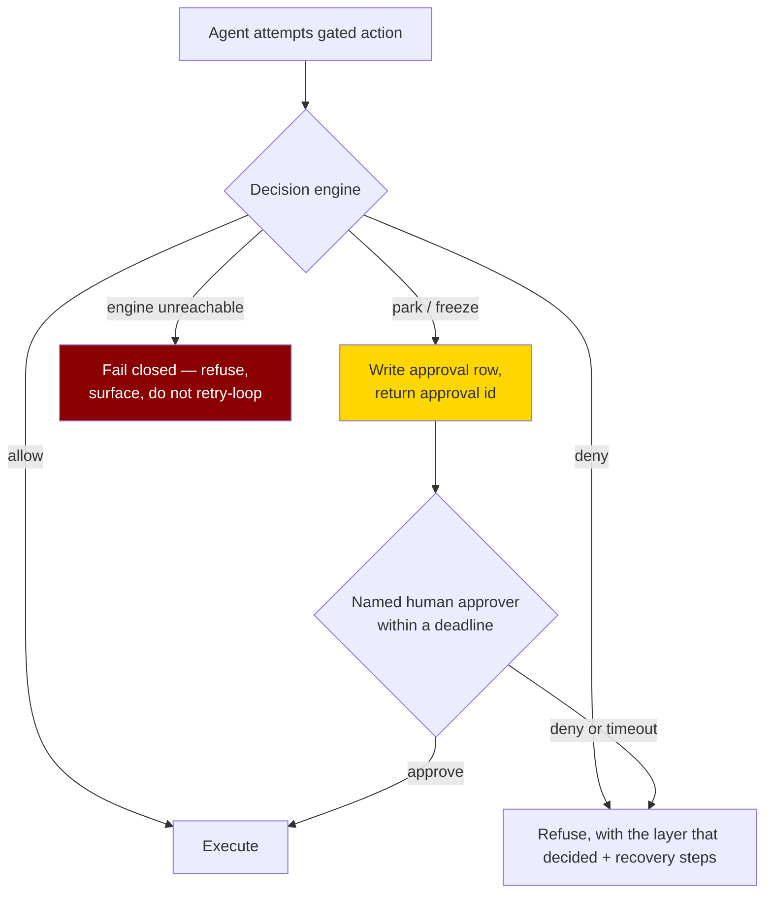
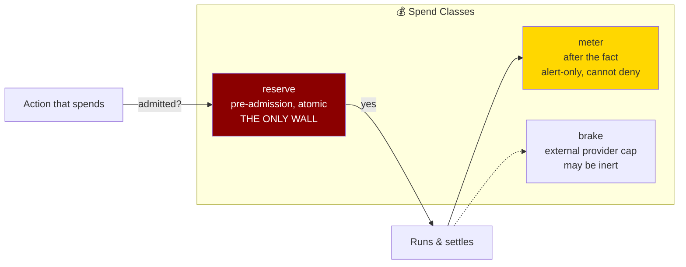
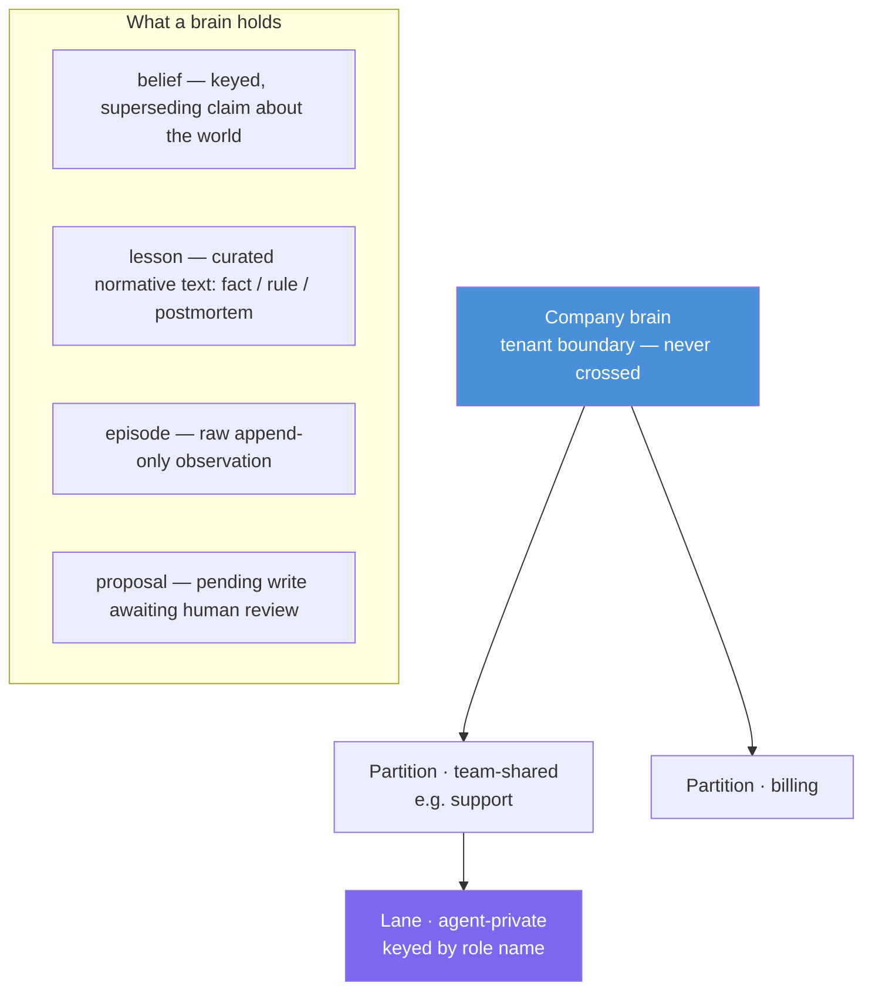
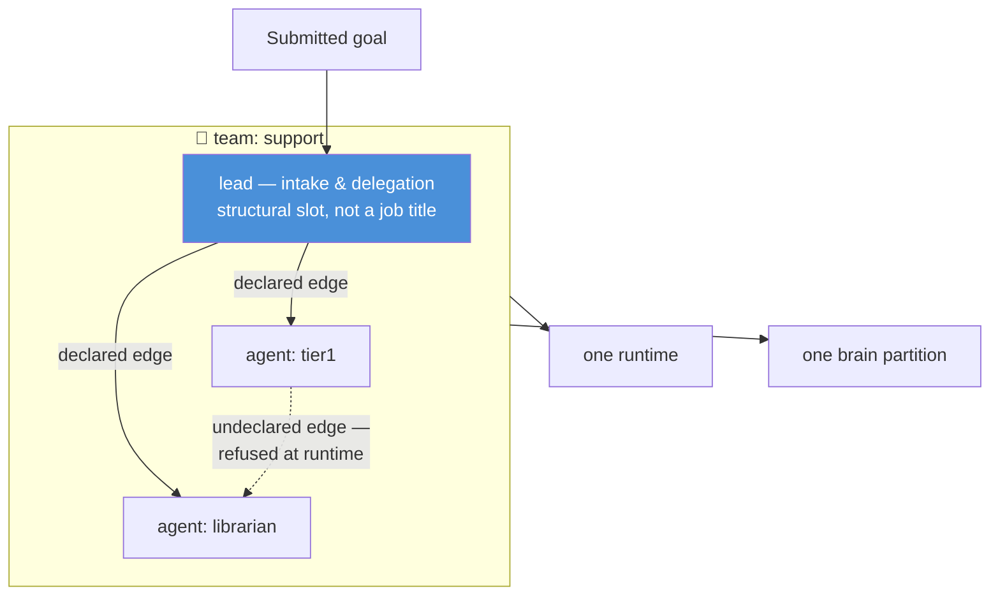
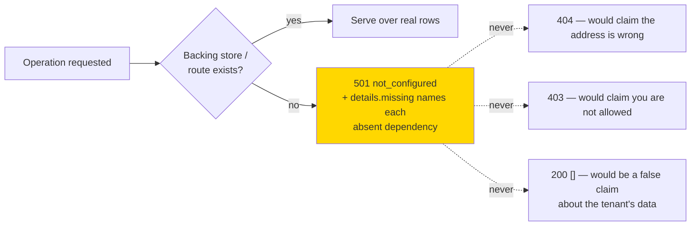

# Governed Agents — Patterns for Safe Agent Fleets

> Design patterns for giving every agent a **governed identity and a governed place to run**: layered policy, spend walls, tiered memory, declarative teams, and honest capability reporting.
>
> Ideas distilled from an analysis of the Naïve agent-onboarding manifest ([usenaive.ai](https://usenaive.ai/)). This document extracts the transferable architecture patterns, not the product.

---

## Overview

The TEKT topology describes *what* an agent fleet looks like (agents, roles, tools, processes, graph). The Modern Enterprise Canvas describes *where* it sits in the enterprise. This document adds the third dimension: **how a fleet is governed** — how authority is granted, narrowed, spent, remembered, and revoked.

The core stance: an agent is not a person and not a process. It is a **declared, governed worker identity** — provisioned as code, decided on every action, and instantly revocable.

---

## 1. Layered Governance — Deny Wins, Allow Narrows

Policy composes downward through fixed layers. A lower layer can only *attenuate* what its parent allows and *escalate* approval requirements — never widen either.

Four composition rules:

1. **Deny wins across layers.**
2. **Allow narrows only** — each layer's allow-set is intersected with its parent's.
3. **Approvals escalate only** — a layer may add a human-approval requirement, never remove one.
4. **Within one layer, rules are ordered and the last match wins** — how you express "everything except this".

The capability default is `deny`, and a config that spells `default: "allow"` should not even compile. Nothing is granted by omission; everything written down is real.

---

## 2. Three-Outcome Decisions — Allow, Deny, Park

One decision function, asked on every gated action, wherever the agent runs. It **fails closed**: if the engine cannot answer, the action is refused, not waved through.

Key ideas:

- **Park is a first-class outcome, not an error.** A parked action returns a value the agent inspects (`{decision, approvalId, message}`) — the agent surfaces it and stops, rather than retrying or routing around it.
- **Every approval has a deadline** (`within: "4h"`) — a park with no deadline is a silent stop.
- **The approver is a named human who is not the requester.** Some actions can never be configured to run unattended: erasing memory, accepting a memory proposal, forming a company, moving money, connecting third-party accounts, writing policy.
- **Refusals are structured** — verdict, deciding layer, recovery steps — so an agent can follow the steps instead of re-sending the same call.

---

## 3. Spend Governance — Three Classes, One Wall

Budget controls are typed by *when* they fire, and only one class can actually stop anything. Conflating them is how a "budget" becomes an alert nobody reads.

- **Reserve buckets stack** across scopes — `company`, `team:support`, `agent:tier1` are all real, simultaneous walls.
- **A meter that could deny should not compile** — the type system encodes the semantics.
- **Unpriceable actions park** — anything that spends money with no price extractor goes to a human; nothing is budget-exempt.
- A kill switch is a **pause, not a decommission**: it fences new dispatch, but work already handed to a worker runs to its end and still spends. Report the in-flight count honestly.

---

## 4. Tiered Memory — The Brain Model

Shared agent memory is structured as a **brain** with company → partition → lane scoping, four typed contents, and write modes that compose like retention: narrower only.

Rules worth stealing:

- **Read down, propose up, promote never.** An agent may read shared scopes and propose upward, but turning a proposal into company truth is a *human* action by a named approver who is not the proposer. `promote` is absent from the agent ability set entirely — a config granting it cannot compile.
- **Retention is required and bounded.** A memory store with no stated retention keeps everything forever, so retention is a mandatory field with a ceiling; a child scope may only narrow it.
- **Beliefs are descriptive, lessons are normative** — cite them differently (`[B*]` vs `[L*]`); a belief is falsified by the world changing, a lesson is not.
- **A memory is never a decision input.** No text in the brain widens what an agent may do — text that talks an agent into a payout meets exactly the refusal it would meet with an empty brain. This is the structural wall against memory-poisoning / prompt-injection escalation.
- **No self-reinforcing memory.** Never reaffirm a lesson just because work that quoted it passed — extension of a memory's life needs an independent witness (a recorded verdict newer than the row).
- **Recall is a fan-out, not a router** — arms run in parallel with per-arm failure isolation, and degraded arms are *reported*, not silently re-planned.
- Scoping by credential beats scoping by parameter: when the write path takes **no identifier** and resolves scope from the injected credential, writing into someone else's scope is *unwritable*, not merely denied.

---

## 5. Teams as Typed Declarations

A team is the unit work runs on: a named group of agents with **exactly one lead**, on one runtime, bound to one memory partition — and every property of it is declared in typed config, applied idempotently, never created imperatively.

- **Delegation edges are declared** (`edges: [["lead", "tier1"]]`). An edge naming a nonexistent role is a compile error; delegation outside declared edges is *refused at runtime*, not just discouraged.
- **Structural invariants live in types**: exactly one lead is a required non-array field — two leads or none is unwritable, not a lint warning.
- **Every operation is addressed to a pair** — (team, tenant). A team has no meaning without the customer it acts for; tenant handles verify existence and never mint implicitly. Cross-tenant is a wall, not a policy.
- **Review rubrics are config**: the questions a reviewer asks of every reply ("does every claim cite a belief or lesson?", "was anything promised the config does not permit?") ship with the team declaration.

---

## 6. Compile Errors Instead of Silent Bugs

The strongest recurring idea: move runtime misconfiguration failures to define time. Every row here was once a silent production bug in some system.

| you write | what should happen |
|---|---|
| a typo'd capability (`emial.send`) | type error on the symbol — not a dead grant that silently never fires |
| `default: "allow"` | does not compile — the default is the literal `deny` |
| a delegation edge to a role that doesn't exist | type error — not a message delivered to nobody at 3am |
| two leads, or none | unwritable — structural field, not validation |
| a child scope with wider retention than its parent | define-time error naming both levels |
| `onExceed: "deny"` on an alert-only meter | type error — the class cannot stop anything, so don't let config claim it can |
| granting an agent the human-only ability (`promote`) | type error — the ability is absent from the union |
| requesting a resource with no backing program declared | define-time error — not silent provisioning of nothing |

Corollary: **the typed symbol form is the only spell-checked form.** Anywhere a bare string is also accepted, the typo check is lost — the strictest surfaces should accept only catalogued slugs.

---

## 7. Honest Capability Reporting

A governed platform must be honest about what is actually served versus merely declared. Three patterns:

- **An honesty report as a first-class verb** (`plan`): prints, per field, what the system *cannot report and why* — run it before telling anyone a control is enforcing something.
- **Distinguish "declared" from "served" from "placed".** A listed team proves it is declared and addressable, not that its runtime answered. Read the placement report (`placed` / `converged` / `refused` + a reason code), not the exit code alone.
- **Refusal codes are ordered and specific** (deployment has no runtime → cutover not signed off → credential missing) — read the code you actually got instead of assuming the last rung is the fix.
- **Pass upstream refusals through verbatim** — whoever debugs a cutover needs the runtime's own words, not a paraphrase.
- **Never substitute a legacy verb to make a refused operation appear to work** — a refusal naming the legacy route describes what the tenant has, it does not recommend switching to it.
- **If something runs unbilled, say so plainly** — "not metered today" is not "free", and no promise should be built on top of it.

---

## 8. Vocabulary Discipline — One Word per Concept

A governed system keeps a single ubiquitous language, and treats synonyms as defects to report, not choices to make. Retired words get an explicit table: what you may see, what to write instead, and why.

| pattern | example |
|---|---|
| one word per concept | `agent`, never `employee` — an agent is not a person |
| structural slots, not job titles | `lead`, never `ceo` |
| declaration verbs, not HR verbs | you *declare* a role and apply; nobody is *hired* |
| wire names may differ from product names, but say so once | product says `organization`, wire keeps `company_id` |
| retired words stay documented | a doc using an old word is out of date, not ambiguous |

This is the same discipline TEKT applies to its glossary — extended with an explicit *deprecation ledger* so old docs date themselves.

---

## 9. Operating Rules for Onboarding Agents

The manifest is itself an artifact worth imitating: a `skill.md` an agent reads *before* touching a platform. Its operating rules generalize to any agent-onboarding surface:

1. **Authenticate with the human — never invent credentials**, never echo or log a key.
2. **Clarify scope before declaring anything** — grant only what was asked; default-deny makes omission safe, but everything written down is real.
3. **Explicit human approval before real-world or spending actions** — and the platform independently enforces this server-side.
4. **Verify before you promise** — run the honesty report before claiming a control enforces anything.
5. **Never build a second source of truth** — no shadow policy checks, allowlists, budget arithmetic, or approval queues; duplicating one is how a governed agent becomes ungoverned.
6. **Be idempotent** — pass idempotency keys, poll status, never re-issue.
7. **Relay platform outputs verbatim** — URLs, refusal codes, approval ids; every character is load-bearing.
8. **Deprecated surfaces are a compatibility promise, not a recommendation** — frozen things keep working and accept nothing new.

---

## 10. Mapping to Arkitype

Where these patterns land in the existing TEKT / Canvas models:

| Governed-agent pattern | TEKT / Canvas home |
|---|---|
| Layered governance & decision engine | TEKT **Framework** · Canvas **Workflows** (approval step becomes typed: allow/deny/park) |
| Spend classes (reserve/meter/brake) | Canvas **Workflows** + **Platforms** (observability meters vs admission walls) |
| Brain: partitions, lanes, beliefs/lessons | TEKT **Knowledge Graph** — adds write-modes, retention, and proposal review to the graph |
| Teams with one lead + declared edges | TEKT **Agents/Roles** — edges make §2's "coordinates" arrows enforceable |
| Declaration-as-code, compile-time refusal | `.arkitype/` specifications — the meta language should refuse invalid topologies at define time |
| Honesty reports, declared vs served | Canvas **Interfaces** — every surface reports what it cannot report |
| Vocabulary discipline | TEKT **Glossary** — extend with a retired-words ledger |

---

## Glossary

| Term | Definition |
|------|-----------|
| **Operator** | The human who holds the account and writes the configuration |
| **Governed identity** | A verified, capability-scoped, revocable identity an agent acts under |
| **Park / freeze** | Decision outcome that writes an approval row for a named human with a deadline |
| **Reserve / meter / brake** | Spend classes: pre-admission wall / post-hoc alert / external cap |
| **Partition** | Team-shared slice of a brain |
| **Lane** | Agent-private working set inside a partition, keyed by role name |
| **Belief / lesson / episode / proposal** | The four typed contents of a brain |
| **Honesty report** | A first-class verb that prints what the system cannot report, and why |
| **Fail closed** | When the decision engine cannot answer, gated actions are refused |
