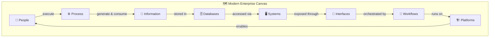
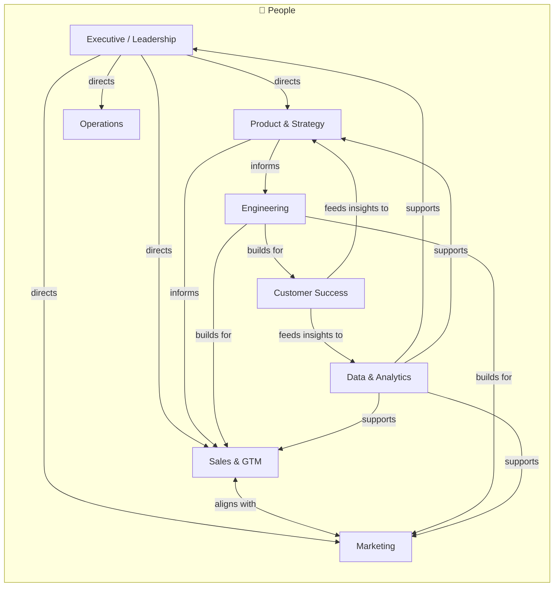
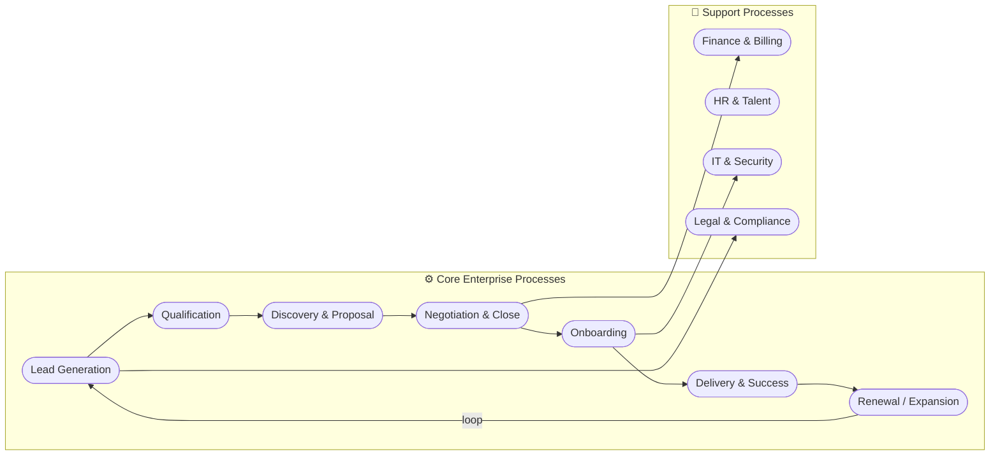
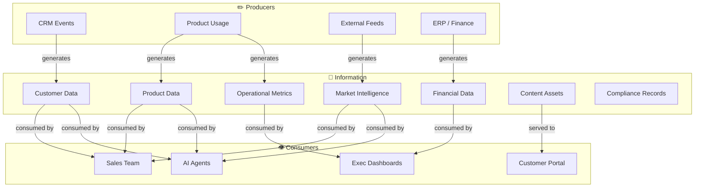
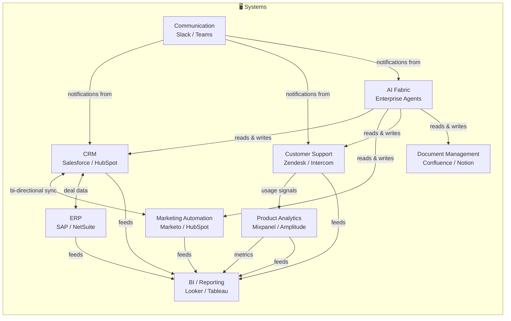
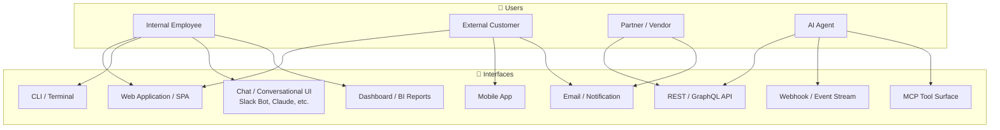
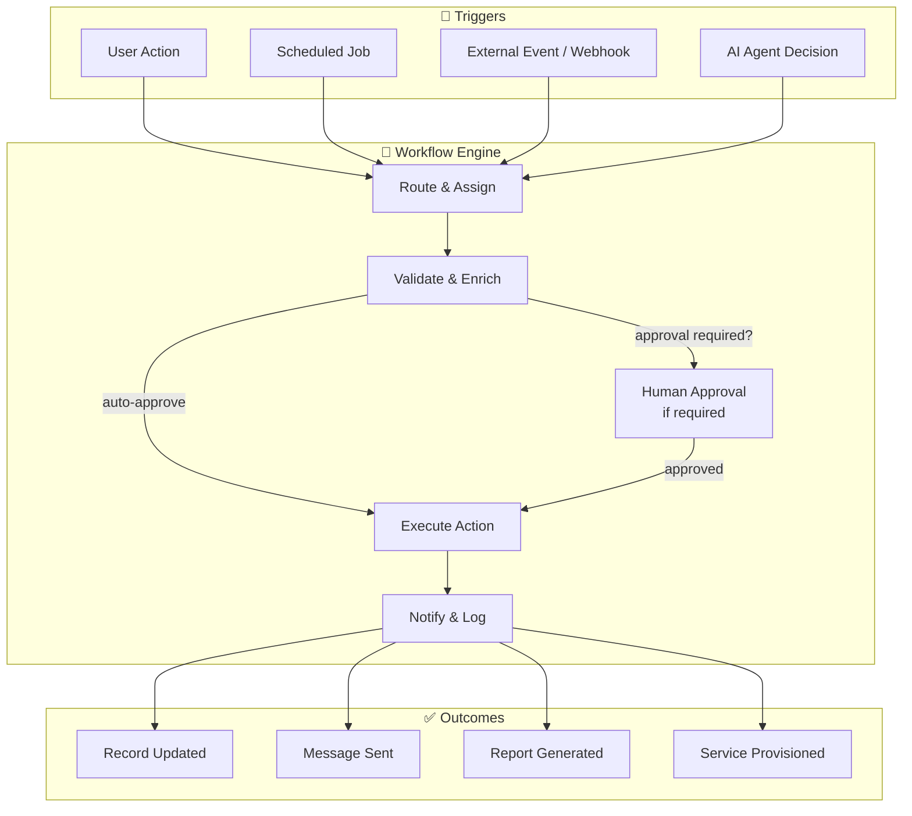
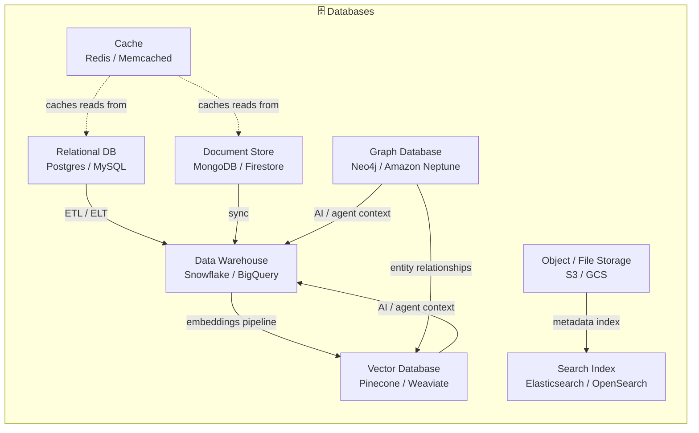
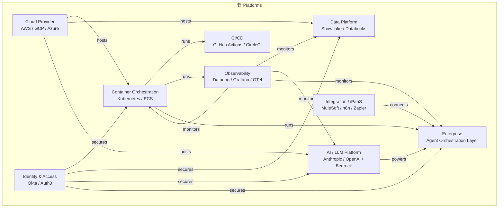
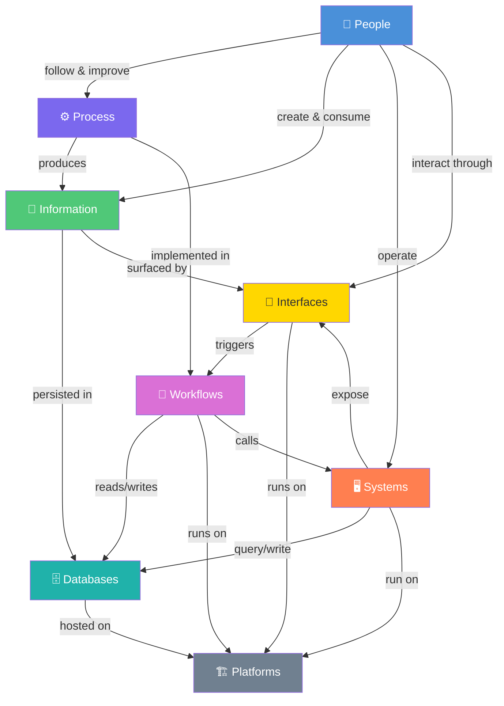

# Modern Enterprise Canvas

> A structured view of the modern enterprise through eight lenses: **People · Process · Information · Systems · Interfaces · Workflows · Databases · Platforms**

---

## Overview

The Modern Enterprise Canvas maps every dimension of an organisation onto a single coherent model. Each lens is a distinct concern; together they form a complete picture of how work gets done, how data flows, and how technology supports human outcomes.

---

## 1. Canvas at a Glance

---

## 2. People

People are the primary actors — they set strategy, execute decisions, and collaborate across the enterprise.

---

## 3. Process

Processes are the repeatable sequences of activities that convert inputs into outcomes.

---

## 4. Information

Information is the lifeblood of the enterprise — it flows through every layer.

---

## 5. Systems

Systems are the applications and services that process, store, and transmit information.

---

## 6. Interfaces

Interfaces are the surfaces through which people and systems interact.

---

## 7. Workflows

Workflows define how tasks, approvals, and automations move through the enterprise.

---

## 8. Databases

Databases store and organise the information assets of the enterprise.

---

## 9. Platforms

Platforms are the foundational infrastructure layers that all other components run on.

---

## 10. Full Enterprise Relationship Map

---

## Canvas Summary Table

| Dimension | Description | Key Examples |
|-----------|-------------|-------------|
| **People** | Human actors who drive and consume enterprise activity | Executives, Sales, Engineering, Ops |
| **Process** | Repeatable sequences converting inputs to outputs | Lead-to-Cash, Onboarding, Support |
| **Information** | Data and knowledge assets flowing through the enterprise | Customer data, metrics, content |
| **Systems** | Applications and services processing information | CRM, ERP, Marketing Automation |
| **Interfaces** | Surfaces where people and systems interact | Web app, API, Chat UI, MCP |
| **Workflows** | Automated or semi-automated task orchestration | Approval flows, integrations, triggers |
| **Databases** | Structured storage for all data assets | Relational, Vector, Graph, Warehouse |
| **Platforms** | Infrastructure layers hosting all capabilities | Cloud, Kubernetes, LLM, AI Fabric |
