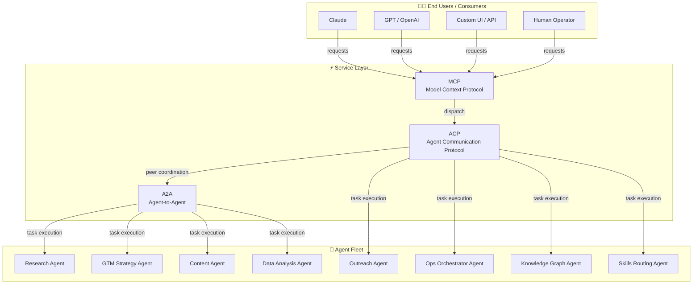
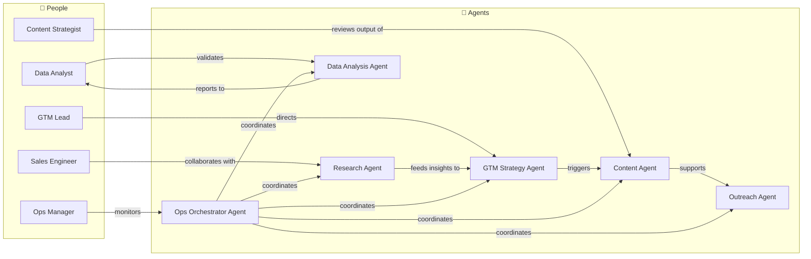
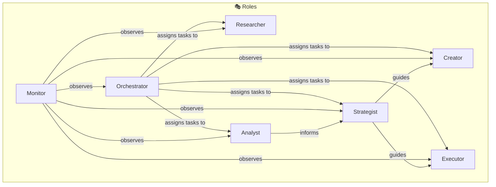
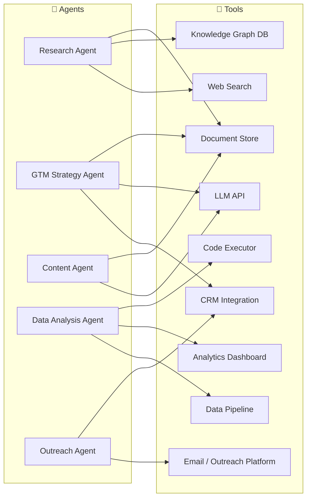
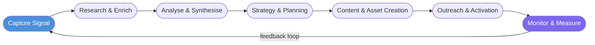
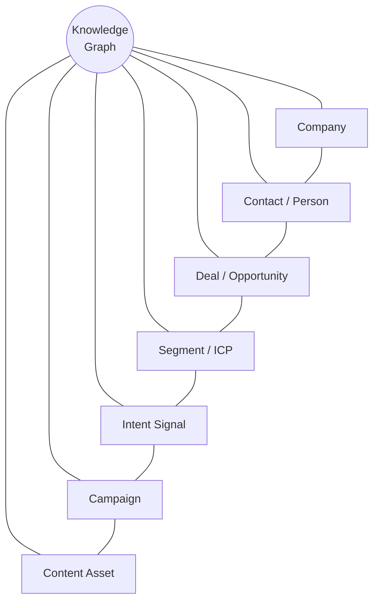
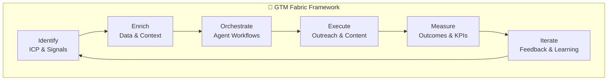
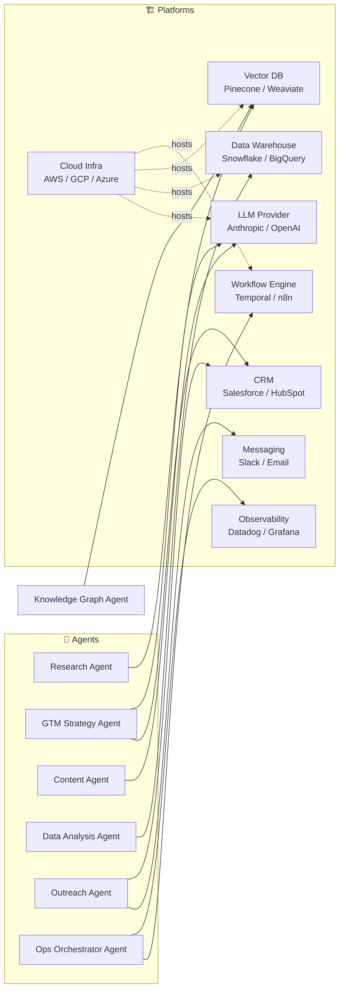
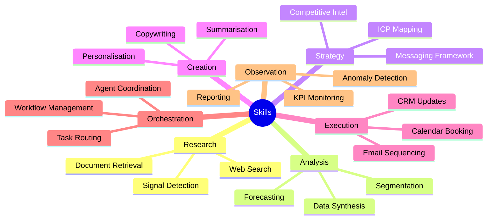
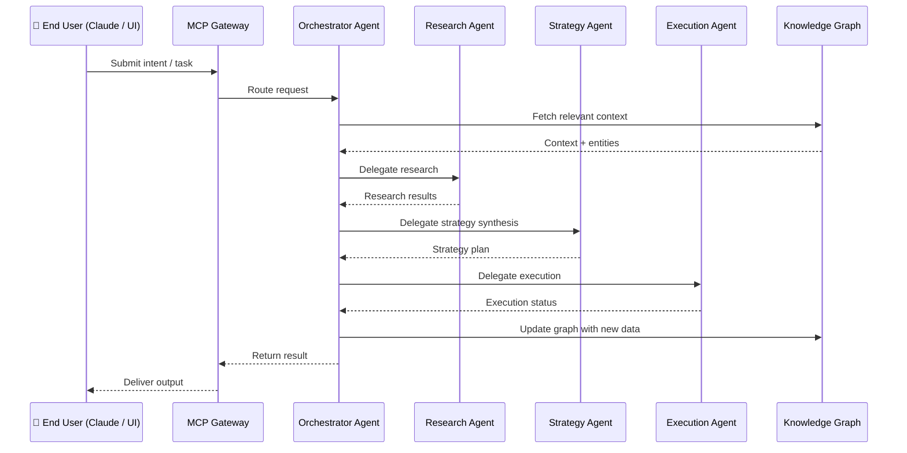

# TEKT — Technology Enterprise Knowledge Topology

> A living architecture diagram of the modern enterprise: **Agents · People · Tools · Roles · Processes · Graph · Framework · Platforms**

---

## Overview

The GTM Fabric enterprise operates as a *fleet of AI agents* orchestrated across three interoperability layers — **MCP** (Model Context Protocol), **ACP** (Agent Communication Protocol), and **A2A** (Agent-to-Agent) — to deliver intelligent services to end users (Claude, GPT, custom UIs, etc.).

Each agent is assigned a **Role**, equipped with **Tools**, guided by **Processes**, embedded in a **Graph** of knowledge, operates within a **Framework**, and runs on one or more **Platforms**.

---

## 1. Fleet Architecture — Agents, Protocols & End Users

---

## 2. Agents & People

---

## 3. Roles

---

## 4. Tools

---

## 5. Processes

---

## 6. Knowledge Graph

---

## 7. Framework

---

## 8. Platforms

---

## 9. Skills Taxonomy

Skills are atomic capabilities that agents combine to fulfill Roles and execute Processes.

---

## 10. End-to-End Service Flow

---

## Glossary

| Term | Definition |
|------|-----------|
| **MCP** | Model Context Protocol — standard for tool-calling and context exchange between LLMs and servers |
| **ACP** | Agent Communication Protocol — standard for inter-agent messaging and task delegation |
| **A2A** | Agent-to-Agent — direct peer coordination between autonomous agents |
| **ICP** | Ideal Customer Profile |
| **KG** | Knowledge Graph — graph database of entities and relationships |
| **Skill** | An atomic capability (e.g., web search, CRM update) assignable to an agent |
| **Fleet** | A coordinated group of agents operating under shared orchestration |
