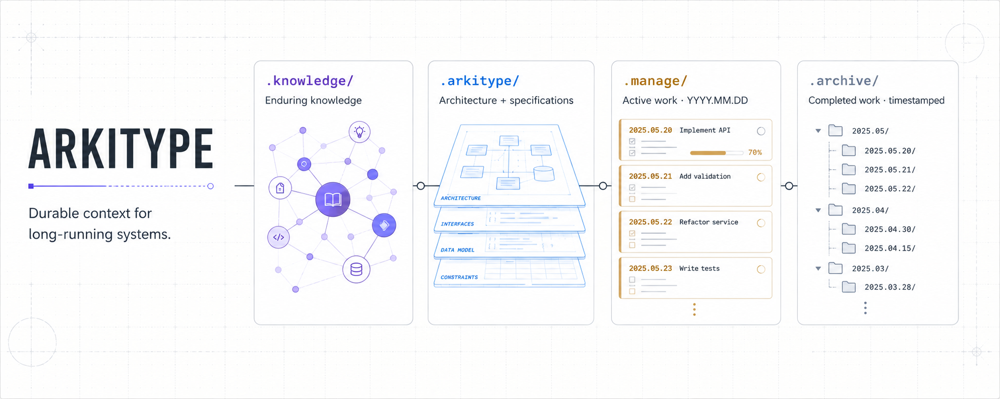
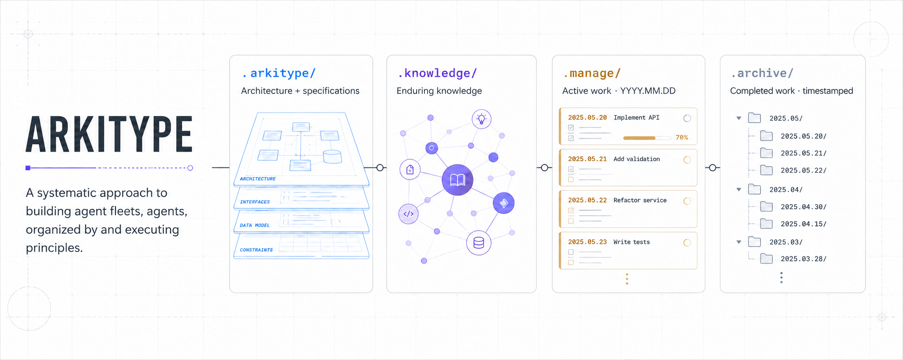

# Arkitype

Arkitype organizes the durable context needed to build and operate a long-running system.

Arkitype is a systematic approach to building agents, agent fleets, and intelligent teams.

## Workspace layout

- `.knowledge/` contains enduring knowledge that can later feed a knowledge graph.
- `.arkitype/` contains the system architecture and related specifications.
- `.manage/` contains day-to-day project and process work. Date-prefixed items use the `YYYY.MM.DD` format.
- `.archive/` contains completed work in timestamped folders.

This structure separates lasting knowledge, architectural decisions, active operations, and completed work so that each remains easy to find over the lifetime of the system.

## See Tekt.md 
[https://tekt.md](Tekt.md) - is being built using the Arkitype core files. 
